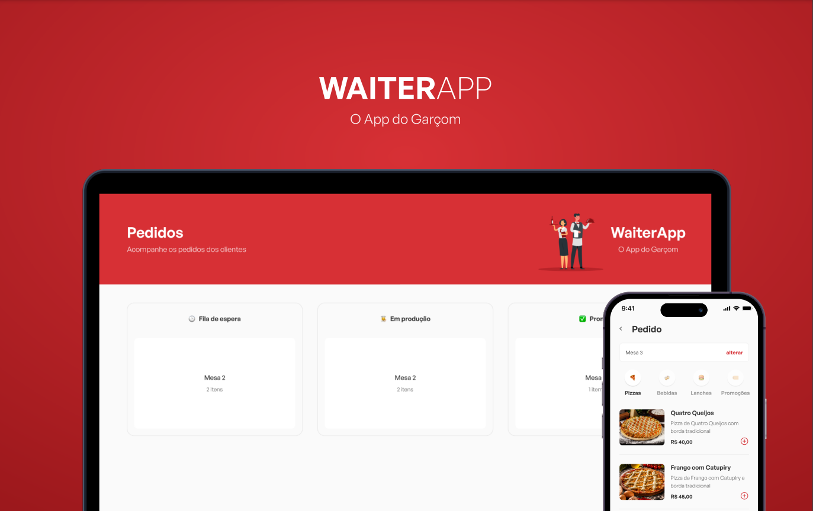
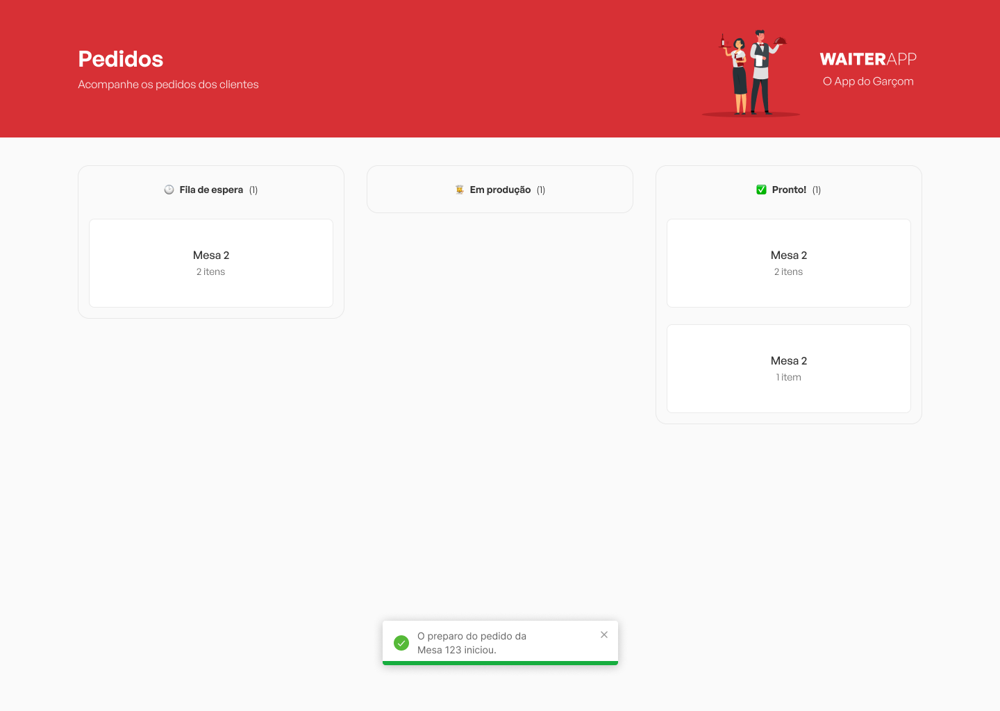
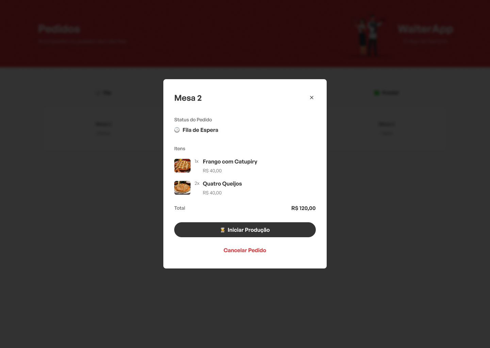
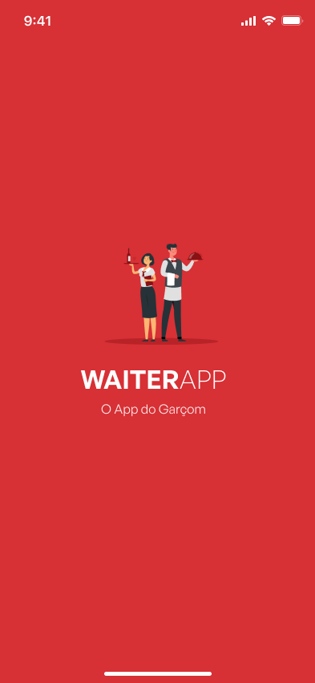
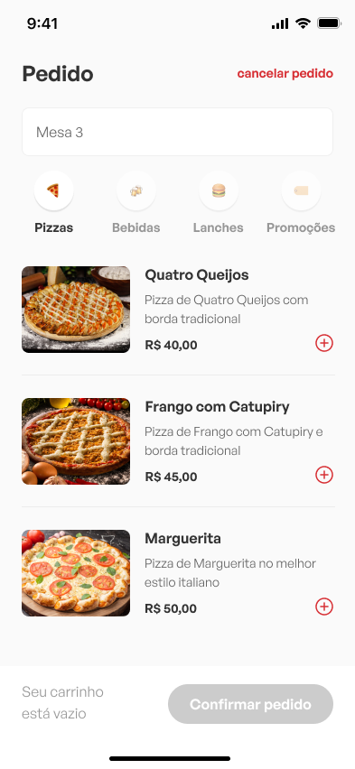
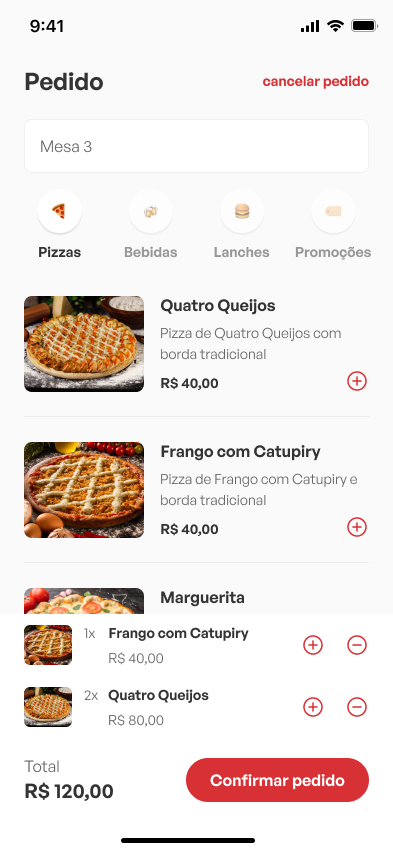
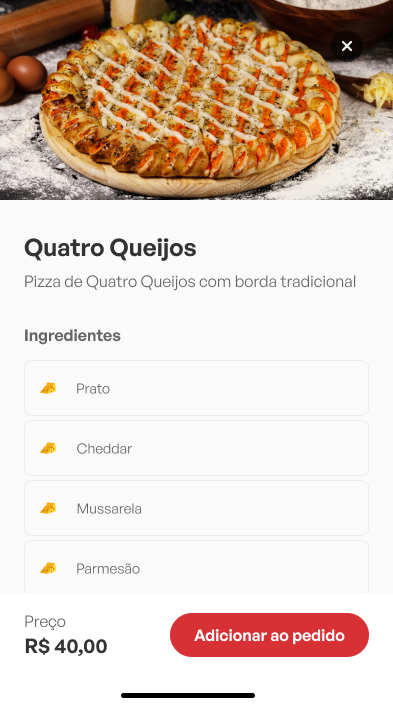
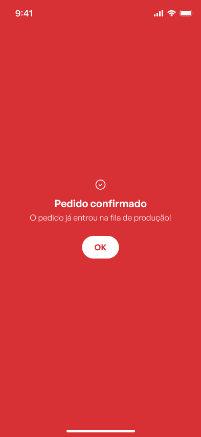

# WaiterApp
Web and mobile application for managing orders in a restaurant..
> Aplicação web e mobile para gerenciamento de pedidos em um restaurante.

 

## Built With:
> Desenvolvido com:
<!-- https://github.com/Ileriayo/markdown-badges -->

  
  
  
  

  
  
  

  
  

  
  
  
  
  
  
  

  

  
  ## Demonstration:
  

  
  

    

      <h3>Web view 💻</h3>
    

    
    
  

  

    

      <h3>App view 📱</h3>
    

    

      
      
      
      
      
    

  

---

 

Developed by [Marcelo Marques](https://www.linkedin.com/in/marcelo-mls/).

  
  

 

> Aplicação desenvolvida durante a semana 'O poder do JStack' do canal <a href="https://www.youtube.com/@imateussilva" target="_blank">@imateussilva</a>
